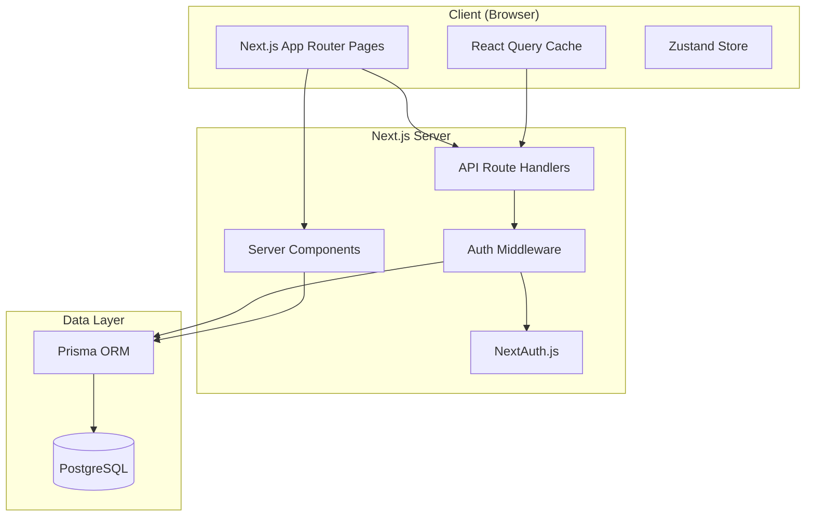

# Design Document

## Overview

전공심화 취업 지원 웹앱은 Next.js 14 (App Router) + TypeScript 기반의 풀스택 웹 애플리케이션입니다.
학생들이 포트폴리오 관리, 채용 공고 트래킹, 기술 스택 로드맵, 면접 준비를 하나의 플랫폼에서 수행할 수 있도록 설계합니다.

### 기술 스택

- **Frontend**: Next.js 14 (App Router), TypeScript, Tailwind CSS, shadcn/ui
- **Backend**: Next.js API Routes (Route Handlers)
- **Database**: PostgreSQL + Prisma ORM
- **Authentication**: NextAuth.js (Credentials Provider)
- **State Management**: React Query (TanStack Query) + Zustand
- **PDF Export**: react-pdf / @react-pdf/renderer
- **Testing**: Vitest + React Testing Library + fast-check (PBT)

### 설계 원칙

- Server Components를 기본으로 사용하고, 인터랙션이 필요한 부분만 Client Components로 분리
- API Routes는 RESTful 설계를 따르며, 모든 엔드포인트는 인증 미들웨어를 통과
- Prisma를 통한 타입 안전한 DB 접근

---

## Architecture



### 요청 흐름

1. 사용자 요청 → Next.js Middleware (세션 검증)
2. 인증된 요청 → Server Component 또는 API Route Handler
3. 데이터 접근 → Prisma → PostgreSQL
4. 응답 → React Query 캐시 업데이트 → UI 리렌더링

---

## Components and Interfaces

### 페이지 구조

```
app/
├── (auth)/
│   ├── login/page.tsx
│   └── register/page.tsx
├── (dashboard)/
│   ├── layout.tsx          # 인증 가드 + 사이드바
│   ├── dashboard/page.tsx
│   ├── portfolio/
│   │   ├── page.tsx
│   │   └── [id]/page.tsx
│   ├── jobs/
│   │   ├── page.tsx
│   │   └── [id]/page.tsx
│   ├── roadmap/page.tsx
│   ├── interview/page.tsx
│   └── profile/page.tsx
└── api/
    ├── auth/[...nextauth]/route.ts
    ├── portfolio/route.ts
    ├── portfolio/[id]/route.ts
    ├── jobs/route.ts
    ├── jobs/[id]/route.ts
    ├── roadmap/route.ts
    ├── roadmap/[id]/route.ts
    ├── interview/route.ts
    └── profile/route.ts
```

### 핵심 컴포넌트

| 컴포넌트 | 역할 |
|---|---|
| `DashboardSummary` | 지원 현황 요약, 면접 일정, 로드맵 진행률 표시 |
| `PortfolioForm` | 포트폴리오 항목 생성/수정 폼 |
| `JobCard` | 채용 공고 카드 (마감 임박 배지 포함) |
| `RoadmapTree` | 기술 스택 트리 시각화 + 진행률 |
| `InterviewCard` | 면접 질문 카드 + 답변 에디터 |
| `MockInterviewModal` | 모의 면접 모드 모달 |

### API 인터페이스

```typescript
// 공통 응답 타입
type ApiResponse<T> = {
  data: T;
  error?: string;
};

// 공통 에러 응답
type ApiError = {
  error: string;
  code: string;
};
```

---

## Data Models

### Prisma Schema

```prisma
model User {
  id            String    @id @default(cuid())
  email         String    @unique
  password      String    // bcrypt hash
  name          String?
  major         String?   // 전공 계열
  targetJob     String?   // 목표 직무
  skills        String[]  // 기술 스택 목록
  createdAt     DateTime  @default(now())
  updatedAt     DateTime  @updatedAt

  portfolios    Portfolio[]
  jobPostings   JobPosting[]
  roadmapItems  RoadmapItem[]
  interviewAnswers InterviewAnswer[]
  customQuestions  InterviewQuestion[]
}

model Portfolio {
  id          String    @id @default(cuid())
  userId      String
  title       String
  description String
  techStack   String[]
  startDate   DateTime
  endDate     DateTime?
  githubUrl   String?
  deployUrl   String?
  createdAt   DateTime  @default(now())
  updatedAt   DateTime  @updatedAt

  user        User      @relation(fields: [userId], references: [id], onDelete: Cascade)
}

model JobPosting {
  id          String          @id @default(cuid())
  userId      String
  company     String
  position    String
  url         String?
  deadline    DateTime?
  status      ApplicationStatus @default(PREPARING)
  createdAt   DateTime        @default(now())
  updatedAt   DateTime        @updatedAt

  user        User            @relation(fields: [userId], references: [id], onDelete: Cascade)
  statusHistory StatusHistory[]
}

enum ApplicationStatus {
  PREPARING     // 서류 준비 중
  APPLIED       // 지원 완료
  DOCUMENT_PASS // 서류 합격
  INTERVIEW     // 면접 예정
  FINAL_PASS    // 최종 합격
  REJECTED      // 불합격
}

model StatusHistory {
  id          String          @id @default(cuid())
  jobId       String
  status      ApplicationStatus
  changedAt   DateTime        @default(now())
  note        String?

  job         JobPosting      @relation(fields: [jobId], references: [id], onDelete: Cascade)
}

model RoadmapItem {
  id          String        @id @default(cuid())
  userId      String
  jobCategory String        // frontend, backend, fullstack, data, ai
  skill       String
  status      SkillStatus   @default(NOT_STARTED)
  referenceLinks String[]
  isCustom    Boolean       @default(false)
  order       Int           @default(0)
  createdAt   DateTime      @default(now())
  updatedAt   DateTime      @updatedAt

  user        User          @relation(fields: [userId], references: [id], onDelete: Cascade)
}

enum SkillStatus {
  NOT_STARTED  // 학습 안 함
  IN_PROGRESS  // 학습 중
  COMPLETED    // 학습 완료
}

model InterviewQuestion {
  id          String    @id @default(cuid())
  category    QuestionCategory
  jobType     String?   // frontend, backend, common
  question    String
  isDefault   Boolean   @default(false)
  userId      String?   // null이면 기본 제공 질문

  user        User?     @relation(fields: [userId], references: [id], onDelete: Cascade)
  answers     InterviewAnswer[]
}

enum QuestionCategory {
  TECHNICAL   // 기술
  PERSONALITY // 인성
  SITUATIONAL // 상황
}

model InterviewAnswer {
  id          String    @id @default(cuid())
  userId      String
  questionId  String
  answer      String
  createdAt   DateTime  @default(now())
  updatedAt   DateTime  @updatedAt

  user        User              @relation(fields: [userId], references: [id], onDelete: Cascade)
  question    InterviewQuestion @relation(fields: [questionId], references: [id], onDelete: Cascade)

  @@unique([userId, questionId])
}
```

### 주요 TypeScript 타입

```typescript
// 대시보드 요약 데이터
type DashboardSummary = {
  applicationCounts: Record<ApplicationStatus, number>;
  upcomingInterviews: JobPosting[];
  roadmapProgress: number; // 0-100
  urgentDeadlines: JobPosting[]; // 7일 이내 마감
};

// 로드맵 진행률 계산
type RoadmapProgress = {
  total: number;
  completed: number;
  percentage: number; // Math.round((completed / total) * 100)
};
```


## Correctness Properties

*A property is a characteristic or behavior that should hold true across all valid executions of a system — essentially, a formal statement about what the system should do. Properties serve as the bridge between human-readable specifications and machine-verifiable correctness guarantees.*

### Property 1: 유효하지 않은 자격증명 거부

*For any* 이메일/비밀번호 조합에서, 등록되지 않은 이메일이거나 비밀번호가 일치하지 않으면 인증 함수는 항상 실패 결과를 반환해야 한다.

**Validates: Requirements 1.3**

### Property 2: 프로필 데이터 round-trip

*For any* 유효한 프로필 데이터(전공 계열, 목표 직무, 기술 스택)를 저장하고 다시 조회하면, 저장한 데이터와 동일한 데이터가 반환되어야 한다.

**Validates: Requirements 1.4**

### Property 3: 대시보드 집계 불변성

*For any* 채용 공고 목록에 대해, 상태별 집계 결과의 합은 전체 채용 공고 수와 항상 같아야 한다.

**Validates: Requirements 2.2**

### Property 4: 마감 임박 필터링

*For any* 마감일을 가진 채용 공고 목록에서, 현재 날짜로부터 N일 이내 마감 여부를 판단하는 함수는 마감일이 [now, now+N] 범위에 있는 공고만 반환해야 한다.

**Validates: Requirements 2.3, 4.5, 4.6**

### Property 5: 로드맵 진행률 계산

*For any* 로드맵 항목 목록에 대해, 진행률은 항상 0 이상 100 이하이며 `Math.round(completed / total * 100)`과 일치해야 한다. 모든 항목이 완료이면 100, 아무것도 완료되지 않으면 0이어야 한다.

**Validates: Requirements 2.4, 5.4**

### Property 6: 포트폴리오 항목 round-trip

*For any* 유효한 포트폴리오 항목 데이터를 생성하고 조회하면, 생성한 데이터와 동일한 항목이 목록에 포함되어야 한다. 삭제 후 조회하면 해당 항목이 목록에 없어야 한다.

**Validates: Requirements 3.1, 3.2, 3.3**

### Property 7: GitHub URL 유효성 검사

*For any* 문자열에 대해, GitHub URL 유효성 검사 함수는 `https://github.com/{owner}/{repo}` 패턴을 만족하는 문자열만 유효로 판단해야 한다.

**Validates: Requirements 3.6**

### Property 8: 채용 공고 round-trip

*For any* 유효한 채용 공고 데이터를 등록하고 조회하면, 등록한 데이터와 동일한 공고가 반환되어야 한다.

**Validates: Requirements 4.1, 4.2**

### Property 9: 상태 변경 이력 누적

*For any* 채용 공고에 대해 N번의 상태 변경을 수행하면, 상태 이력 레코드 수는 정확히 N개여야 한다.

**Validates: Requirements 4.3**

### Property 10: 채용 공고 검색 결과 정확성

*For any* 채용 공고 목록과 검색어에 대해, 검색 결과는 회사명 또는 직무명에 검색어를 포함하는 항목만 반환해야 한다.

**Validates: Requirements 4.4**

### Property 11: 로드맵 항목 상태 round-trip

*For any* 로드맵 항목에 대해 상태를 변경하고 조회하면, 변경된 상태가 반환되어야 한다. 커스텀 항목과 참고 링크를 포함한 항목도 동일하게 적용된다.

**Validates: Requirements 5.3, 5.5, 5.6**

### Property 12: 직무별 로드맵 비어있지 않음

*For any* 유효한 직무 카테고리(frontend, backend, fullstack, data, ai)에 대해, 로드맵 템플릿은 최소 1개 이상의 기술 항목을 포함해야 한다.

**Validates: Requirements 5.1, 5.2**

### Property 13: 면접 답변 round-trip

*For any* 질문-답변 쌍에 대해, 답변을 저장하고 조회하면 동일한 답변이 반환되어야 하며 해당 질문은 답변 완료 상태여야 한다.

**Validates: Requirements 6.2, 6.3**

### Property 14: 커스텀 질문 round-trip

*For any* 커스텀 면접 질문을 추가하고 목록을 조회하면, 해당 질문이 목록에 포함되어야 한다.

**Validates: Requirements 6.4**

### Property 15: 질문 필터링 정확성

*For any* 질문 목록과 필터 조건(카테고리, 직무)에 대해, 필터링 결과는 해당 조건을 만족하는 질문만 포함해야 한다.

**Validates: Requirements 6.5**

### Property 16: 모의 면접 질문 범위

*For any* 저장된 질문 목록에서 모의 면접 모드가 반환하는 질문은 항상 해당 목록에 속하는 질문이어야 한다.

**Validates: Requirements 6.6**

### Property 17: 사용자 데이터 격리

*For any* 두 사용자 A, B에 대해, 사용자 A의 인증 토큰으로 요청한 데이터 조회 결과에는 사용자 B의 데이터가 포함되지 않아야 한다.

**Validates: Requirements 7.5**

---

## Error Handling

### 인증 오류

| 상황 | 처리 방식 |
|---|---|
| 잘못된 자격증명 | 401 응답 + "이메일 또는 비밀번호가 올바르지 않습니다" 메시지 |
| 만료된 세션 | 로그인 페이지로 리다이렉트 |
| 권한 없는 리소스 접근 | 403 응답 |

### 데이터 오류

| 상황 | 처리 방식 |
|---|---|
| 유효하지 않은 입력 | 400 응답 + 필드별 오류 메시지 (Zod 스키마 검증) |
| 존재하지 않는 리소스 | 404 응답 |
| 중복 데이터 | 409 응답 + 중복 안내 메시지 |

### 네트워크/서버 오류

| 상황 | 처리 방식 |
|---|---|
| 데이터 저장 실패 | 저장 실패 토스트 + 재시도 버튼 |
| 데이터 조회 실패 | 오류 메시지 + 새로고침 버튼 |
| 로딩 중 | 스켈레톤 UI / 스피너 표시 |

### 클라이언트 측 유효성 검사

- **이메일**: RFC 5322 형식 검사
- **비밀번호**: 최소 8자, 영문+숫자 조합
- **GitHub URL**: `https://github.com/{owner}/{repo}` 패턴
- **마감일**: 현재 날짜 이후여야 함 (신규 등록 시)
- **필수 필드**: 회사명, 직무명, 포트폴리오 제목 등

모든 폼 유효성 검사는 **Zod** 스키마로 정의하고, React Hook Form과 연동합니다.

---

## Testing Strategy

### 이중 테스트 접근법

단위 테스트와 속성 기반 테스트를 함께 사용하여 포괄적인 커버리지를 확보합니다.

- **단위 테스트 (Vitest + React Testing Library)**: 특정 예시, 엣지 케이스, 에러 조건 검증
- **속성 기반 테스트 (Vitest + fast-check)**: 임의 입력에 대한 보편적 속성 검증

### 단위 테스트 대상

- 로그인 성공 시 대시보드 리다이렉트 (Requirements 1.2)
- 각 직무 카테고리별 로드맵 템플릿 비어있지 않음 (Requirements 5.1)
- 직무별 면접 질문 목록 비어있지 않음 (Requirements 6.1)
- 삭제 확인 다이얼로그 표시 (Requirements 3.4)
- 로딩/에러 상태 UI 컴포넌트 렌더링

### 속성 기반 테스트 설정

**라이브러리**: `fast-check` (TypeScript 네이티브 지원, Vitest 통합)

**설정**: 각 속성 테스트는 최소 100회 반복 실행

```typescript
// 예시: fast-check 설정
import fc from 'fast-check';
import { test } from 'vitest';

test('Property 3: 대시보드 집계 불변성', () => {
  // Feature: career-support-webapp, Property 3: 대시보드 집계 불변성
  fc.assert(
    fc.property(fc.array(jobPostingArbitrary), (postings) => {
      const counts = aggregateByStatus(postings);
      const total = Object.values(counts).reduce((a, b) => a + b, 0);
      return total === postings.length;
    }),
    { numRuns: 100 }
  );
});
```

### 속성 테스트 목록

각 속성 테스트는 설계 문서의 Correctness Properties를 참조합니다.

| 테스트 | 대상 속성 | 태그 |
|---|---|---|
| 유효하지 않은 자격증명 거부 | Property 1 | `Feature: career-support-webapp, Property 1` |
| 프로필 데이터 round-trip | Property 2 | `Feature: career-support-webapp, Property 2` |
| 대시보드 집계 불변성 | Property 3 | `Feature: career-support-webapp, Property 3` |
| 마감 임박 필터링 | Property 4 | `Feature: career-support-webapp, Property 4` |
| 로드맵 진행률 계산 | Property 5 | `Feature: career-support-webapp, Property 5` |
| 포트폴리오 항목 round-trip | Property 6 | `Feature: career-support-webapp, Property 6` |
| GitHub URL 유효성 검사 | Property 7 | `Feature: career-support-webapp, Property 7` |
| 채용 공고 round-trip | Property 8 | `Feature: career-support-webapp, Property 8` |
| 상태 변경 이력 누적 | Property 9 | `Feature: career-support-webapp, Property 9` |
| 채용 공고 검색 결과 정확성 | Property 10 | `Feature: career-support-webapp, Property 10` |
| 로드맵 항목 상태 round-trip | Property 11 | `Feature: career-support-webapp, Property 11` |
| 직무별 로드맵 비어있지 않음 | Property 12 | `Feature: career-support-webapp, Property 12` |
| 면접 답변 round-trip | Property 13 | `Feature: career-support-webapp, Property 13` |
| 커스텀 질문 round-trip | Property 14 | `Feature: career-support-webapp, Property 14` |
| 질문 필터링 정확성 | Property 15 | `Feature: career-support-webapp, Property 15` |
| 모의 면접 질문 범위 | Property 16 | `Feature: career-support-webapp, Property 16` |
| 사용자 데이터 격리 | Property 17 | `Feature: career-support-webapp, Property 17` |

### 테스트 파일 구조

```
__tests__/
├── unit/
│   ├── auth.test.ts
│   ├── dashboard.test.ts
│   ├── portfolio.test.ts
│   ├── jobs.test.ts
│   ├── roadmap.test.ts
│   └── interview.test.ts
└── property/
    ├── auth.property.test.ts
    ├── dashboard.property.test.ts
    ├── portfolio.property.test.ts
    ├── jobs.property.test.ts
    ├── roadmap.property.test.ts
    └── interview.property.test.ts
```
